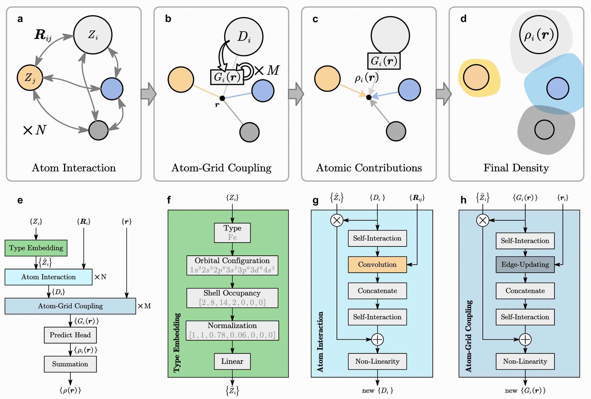

# EAC-Net

An open-source code for predicting atomic contributions charge density using Equivariant Message Passing Networks.

## Features
- Higher accuracy and faster training and inference speed
- Outputting the charge density distribution of a single atom
- Support caching atomic local environment during inference phase to accelerate inference speed
- Support CHGCAR/H5 dataset format
- Support multi GPUs parallel training

## Citation

## Installation

```bash
# Clone the repository
git clone https://github.com/qin2xue3jian4/EAC-Net
cd EAC-Net

# Install the package
pip install .
```

> After installation, the `eac` entry point becomes available system-wide.

---

## Quickstart

### Pre-install (development)

```bash
# Launch directly via Python
python eac/entry.py <mode> [ARGUMENTS]
```

### Post-install (CLI)

```bash
# Use the installed CLI
eac <mode> [ARGUMENTS]
```

### Distributed Training with torchrun

```bash
# Using python script
torchrun --nproc_per_node 2 eac/entry.py train [ARGUMENTS]

# Using module invocation
torchrun --nproc_per_node 2 -m eac.entry train [ARGUMENTS]
```
> Currently, `torchrun` is only applicable in training mode.
---

## Modes & Arguments

EAC-Net supports three modes, each exposing its own set of arguments:

```bash
# List arguments and help
eac train -h
```

> **Note**: Replace `train` with `test` or `predict` to switch modes.

---

## Datasets
Although `EAC` supports the direct use of `CHGCAR` as a dataset, for efficiency, we recommend converting the data into an `h5` format dataset before training.

For conversion commands, please refer to:
```bash
python scripts/convert_dir.py <source_dir> <target_dir>
```
In addition, considering the particularity of the charge density dataset, `EAC` also supports sample datasets, which can be constructed by adding parameters such as `--random 50000` to the above command.

For more parameters and methods for screening samples, please read the `scripts/convert_dir.py` directly.

## License

MIT © Your Organization
