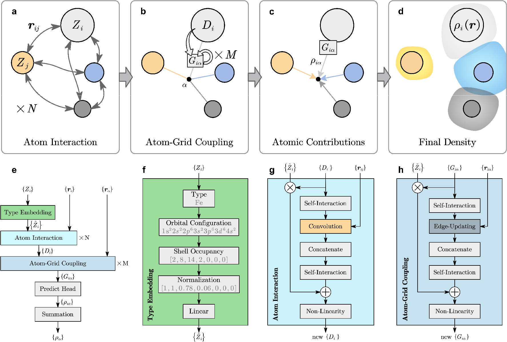

<div align="right">

[English](README.md) | 中文

</div>

# EAC-Net



使用等变消息传递网络预测原子贡献电荷密度的机器学习模型。

## 目录
- [EAC-Net](#eac-net)
  - [目录](#目录)
  - [特点](#特点)
  - [安装](#安装)
  - [快速启动](#快速启动)
    - [预安装（开发）](#预安装开发)
    - [安装后](#安装后)
    - [使用torchrun进行分布式训练](#使用torchrun进行分布式训练)
  - [模式和参数](#模式和参数)
  - [数据集](#数据集)
  - [示例](#示例)
    - [训练模型](#训练模型)
    - [测试模型](#测试模型)
    - [进行预测](#进行预测)
  - [引用](#引用)
  - [许可证](#许可证)

## 特点

- 更高的准确性和更快的训练和推理速度

- 输出单个原子的电荷密度分布

- 在推理阶段支持缓存原子本地环境，以加快推理速度

- 支持CHGCAR/H5数据集格式

- 支持多GPU并行训练

## 安装

```bash
# 克隆存储库
git clone https://github.com/qin2xue3jian4/EAC-Net
cd EAC-Net

# 安装软件包
pip install .
```

> 安装后，`eac`入口点在系统范围内可用。

---

## 快速启动

### 预安装（开发）

```bash
# 直接通过Python启动
python eac/entry.py <mode> [ARGUMENTS]
```

### 安装后

```bash
# 使用已安装的 CLI​
eac <mode> [ARGUMENTS]
```

### 使用torchrun进行分布式训练

```bash
# 直接通过Python启动
torchrun --nproc_per_node 2 eac/entry.py train [ARGUMENTS]

# 使用模块调用
torchrun --nproc_per_node 2 -m eac.entry train [ARGUMENTS]
```
> 目前 `torchrun` 仅支持在训练环境中使用.
---

## 模式和参数

EAC-Net 支持三种模式，每一种都有其参数:

```bash
# 参数列表与帮助信息
eac train -h
```

> **注**: 使用 `test` 或 `predict` 替换 `train` 来切换模式.

---

## 数据集

尽管 `EAC` 支持直接使用 `CHGCAR` 作为数据集，但出于效率考虑，我们建议在训练前将数据转换为 `h5` 格式的数据集。

转换命令请参考：
```bash
python scripts/convert_dir.py <源目录> <目标目录>
```
此外，考虑到电荷密度数据集的特殊性，`EAC`还支持样本数据集，可通过在上述命令中添加 `--random 50000`等参数来构建。

关于更多筛选样本的参数和方法，请直接阅读 `scripts/convert_dir.py` 文件。

## 示例

以下示例展示了如何使用 `EAC-Net` 对水分子体系进行电荷密度建模

### 训练模型

```bash
eac train examples/water/input.yaml --out outputs/train --plot
```

训练过程中，程序会自动：

- 读取 `input.yaml` 输入脚本中设置的训练数据，会自动组合`data.root_dir`和`data.train.paths`，支持通过通配符快捷设置文件路径

- 在 `outputs/train` 目录下保存训练日志和模型文件

- 输出训练进度和损失函数变化情况

在训练过程中，如果想停止训练，请在输出目录中新建一个名为 `stop` 的文件，程序会自动停止训练。

### 测试模型

训练完成后，使用以下命令测试模型在验证集上的表现：

```bash
eac test --model outputs/train/models/model.pt --paths examples/water/data/8.h5 --paths examples/water/data/8.h5 --out outputs/test --plot
```

该命令会：

- 加载训练好的模型 (`outputs/train/models/model.pt`)

- 对指定的数据集进行测试，可以通过 `--paths` 参数指定多个数据集

- 输出测试指标（如 `MSE`、`MAE` 等）

- 通过设置 `--plot` 参数生成预测结果与真实值的对角线图

### 进行预测

使用训练好的模型对新结构进行电荷密度预测：

```bash
eac predict --model outputs/train/models/model.pt --paths examples/water/POSCAR --out outputs/predict --num-workers 4 --ngfs 50*50*50 --probe-size 200
```

预测功能支持：

- 输入 `POSCAR`, `h5`, `CHGCAR` 等格式的结构文件

- 输出 `CHGCAR`, `h5` 等格式的电荷密度文件

- 通过参数`--ngfs`设置预测的网格大小，如果输入的是`h5`, `CHGCAR` 等包含网格信息的结构文件，在不设置`--ngfs`参数的情况下，程序会自动从结构文件中获取网格大小

- 通过参数`--probe-size`设置并行预测的格点数量

## 引用
`EAC-Net`模型的预印版本在 arXiv 上已发布，请使用以下引用:
```
@misc{xuejian2025eacnetrealspacechargedensity,
      title={EAC-Net: Real-space charge density via equivariant atomic contributions}, 
      author={Qin Xuejian and Lv Taoyuze and Zhong Zhicheng},
      year={2025},
      eprint={2508.04052},
      archivePrefix={arXiv},
      primaryClass={cond-mat.mtrl-sci},
      url={https://arxiv.org/abs/2508.04052}, 
}
```
## 许可证

`EAC-Net` 使用 MIT 许可证授权。
