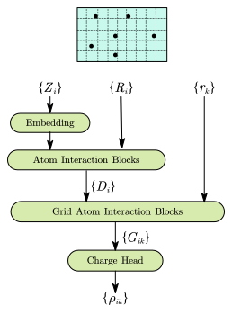
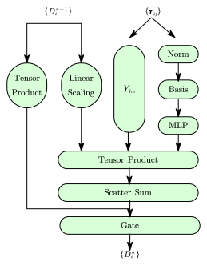
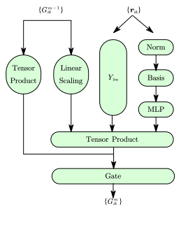

# 摘要

# 正文

## 引言

电荷密度是凝聚态物理与材料科学的核心物理量之一，它直接决定了材料的电子结构、化学键性质以及电磁响应行为。从催化活性位点的识别到拓扑量子态的分析，高精度电荷密度预测为理解材料功能提供了关键视角。然而，传统基于密度泛函理论（DFT）的第一性原理计算虽能提供精确结果，但其计算复杂度随体系规模呈三次方增长，难以直接应用于大尺度或高通量筛选场景。传统加速策略（如赝势法、截断基组）往往以牺牲精度为代价，面临着精度与效率的矛盾。

近年来，机器学习（ML）方法通过从DFT计算数据中学习电子结构映射关系，为突破上述瓶颈提供了新范式。一类基于原子局域基组展开，通过机器学习模型预测局域基组展开系数以重构体系电荷分布，典型工作包括利用高阶原子基函数进行展开并学习系数的研究​；另一类基于空间网格（grid-based），通过深度神经网络直接预测离散网格点上的电荷密度值，并自然地保持物理对称性和局部结构信息​。更近期的ChargE3Net等E(3)等变图神经网络方法，则通过构建高阶等变特征，显著提升了模型的可表达性和在复杂材料体系中的泛化能力​。

类似于系统能量，在密度泛函理论中，电子电荷密度是直接从Kohn-Sham方程得到的全局物理量，而没有显式地分解为单独某个原子的电荷密度贡献。但在机器学习势函数模型中，通常对系统能量进行可加性设定，即$E=\sum_i E_i$，其中的$E_i$由原子$i$的局域环境决定。受此启发，我们想到，可以将格点电荷密度分解为邻域原子贡献的线性叠加，即
$$\rho \left( \boldsymbol{r}_k \right) =\sum_{i\in \mathscr{N}\left( k \right)}{\rho _i\left( \boldsymbol{r}_k-\boldsymbol{R}_i \right)}$$
其中$\mathscr{N}\left( k \right)$表示$k$格点的邻域原子集合，$\boldsymbol{r}_k,\boldsymbol{R}_i$分别表示$k$格点与$i$原子的空间坐标。

基于此，我们提出了一种基于等变网络，使用原子局域环境预测其对邻域格点电荷密度的贡献的机器学习模型。它的精度……，对于电荷转移……

## 方法

<table>
  <tr>
    <td>
      

        <figure>
          
          <figcaption>图1-a：模型整体结构</figcaption>
        </figure>
      

    </td>
    <td>
      

        <figure>
          
          <figcaption>图1-b：原子交互结构</figcaption>
        </figure>
      

    </td>
    <td>
      

        <figure>
          
          <figcaption>图1-c：原子-格点交互结构</figcaption>
        </figure>
      

    </td>
  </tr>
</table>

在传统的量子化学计算中，电子密度通常通过基组展开的方式表示。例如，使用高斯型轨道作为基函数，将电子密度表示为这些基函数的线性组合。每个基函数通常与特定的原子相关联，因此，电子密度的这种表示方式自然地体现了原子的贡献。此外，还有Bader的Atom in Molecule(AIM)理论和Hirshfeld分解法，这些方法基于电子密度的拓扑结构或参考态的比较，将整个系统的电子密度划分为各个原子的部分，从而实现对电子密度的原子级分析。

综上所述，将电子密度在空间格点上分解为各原子的贡献，并据此训练机器学习模型，是一种物理上合理且具有实际应用价值的方法。

### 获得原子局域环境描述

电荷密度对化学环境的敏感性要求模型既能捕捉原子近邻的几何排列，又能严格保持物理对称性（旋转、平移、置换不变性）。为实现这一目标，我们采用类似于NequiP的等变图神经网络构建原子描述符，其核心思想是将原子特征表示为与空间方向相关的张量，并通过约束网络操作的等变性，使得特征变换与输入坐标的旋转/平移同步协变。具体来说，这一部分的框架如`图1-b`所示。

#### 特征初始化​

每个原子的初始特征由其元素类型嵌入为高阶张量。$$D^0_i=Embedding(Z_i)$$

对于原子对$(i,j)$，相对坐标$\boldsymbol{r}_{ij}$被映射为方向与距离的分离表示：
- ​方向分量​​：投影至球谐函数基底，生成角动量特征$Y(\mathbf{\hat{r}}_{ij})$
- ​径向分量​​：距离$r_{ij}$经平滑截断的贝塞尔基函数展开$\{t_{ij}^p\}$

  $$t_{ij}^p=B^p(r_{ij})$$

  其中$B^p(r_{ij})$是贝塞尔函数。

#### 等变消息传递与特征更新

通过多层消息传递，原子$i$的特征$D^n_i$逐步融合其化学环境信息。每层操作包括三步：消息构造、消息聚合与门控更新。

##### 消息构造

对于原子对$(i,j)$，基于张量积融合原子特征与几何编码，构造消息$\boldsymbol{msg}^n_{ij}$：

$$\boldsymbol{msg}_{ij}^{n}=\sum_{}MLP({D_{i}^{n-1})\otimes Y\left( r_{ij} \right) \cdot w^p_{ij}}$$

其中$MLP$是全连接神经网络，$\otimes$表示将原子特征$D_{i}^{n-1}$与球谐函数$Y$进行角动量耦合，生成更高阶或降阶的张量（由Clebsch-Gordan系数约束），从而保证输出的等变性。$w_{ij}=MLP(t_{ij})$

##### 消息聚合

对每个原子$i$，聚合所有邻居消息$\boldsymbol{msg}^n_{ij}$：
  
$$\tilde{D}_{i}^{n}=\frac{1}{\sqrt{\mu _i}}\sum_{j\in \mathscr{N}\left( i \right)}{\boldsymbol{msg}_{ij}^{n}}$$

##### 门激活​
将聚合消息与原特征融合后，通过门激活网络，以加入非线性。

### 原子对格点的影响

这一部分的网络与前一部分获得原子局域环境描述的网络大体相似，只是为了让信息只在指定的原子与格点之间传播，不再有消息聚合这一步。

#### 特征初始化​

每个原子$i$-格点$k$对应的边$e_{ik}$的特征初始值由前一部分原子局域环境描述网络获得，即$G^0_{ik}=D^N_{i}$

对于边$e_{ik}$，相对坐标$\boldsymbol{r}_{ik}$被映射为方向与距离的分离表示，与上面对原子对$(i,j)$的相对坐标处理方法相同。

#### 等变消息传递与特征更新

通过多层消息传递，边$e_{ik}$的特征$G^m_{ik}$逐步融合原子$i$的化学环境信息以及原子$i$和格点$k$的几何关系。每层操作包括消息构造与门控更新。

##### 消息构造

对于边$e_{ik}$，基于张量积融合原子特征与几何编码，构造消息$\boldsymbol{msg}^m_{ij}$：

$$\boldsymbol{msg}_{ij}^{m}=\frac{1}{\sqrt{\mu _{ik}}}\sum_{}MLP({G_{ik}^{m-1})\otimes Y\left( r_{ik} \right) \cdot w^p_{ik}}$$

其中$MLP$是全连接神经网络，$\otimes$表示将原子特征$G_{ik}^{m-1}$与球谐函数$Y$进行角动量耦合，生成更高阶或降阶的张量（由Clebsch-Gordan系数约束），从而保证输出的等变性。$w_{ik}=MLP(t_{ik})$

##### 门激活​
对边$e_{ik}$，将消息与原特征融合后，通过门激活网络，以加入非线性。

#### 最后一层
对于最后一层网络(即$m=M$)，只保留输出结果为标量的路径，并通过全连接神经网络显式压缩维度以避免过参数化。

### 门控网络
电荷密度在空间中的分布不仅取决于原子的局域化学环境，还需反映原子与目标格点间的几何关系。为实现这一目标，本工作提出​​动态权重-强度分解机制​​，将格点电荷密度显式建模为邻域原子贡献的加权和，其核心思想为：
$$\rho _k=\sum_{i\in \mathscr{N}\left( k \right)}{w_{ik}\cdot s_{ik}}$$
其中权重项$w_{ik}$编码原子$i$对格点$k$的几何与化学相关性，强度项$s_{ik}$表征原子$i$在格点$k$处的电荷贡献幅度。以下详述其建模过程。

### 动态权重计算​

权重项$w_{ik}$需满足​​归一化约束​$\sum_{i\in \mathscr{N}\left( k \right)}{w_{ik}}=1$与​​物理合理性​​（随距离平滑衰减），其计算分为两阶段：
- **​权重项​**​：可解释为原子 $i$ 的电子云在格点 $k$ 处的空间分布概率，受距离衰减与化学成键共同调制。
- **​强度项​**​：反映原子 $i$ 在特定方向上的电荷极化强度，由局域化学键性质（如电负性差异）决定。此部分设计通过​**​几何-化学解耦建模​**​与​**​显式归一化约束​**​，在保持物理对称性的同时赋予模型可解释性，为分析原子级电荷转移机制提供了新途径。
#### 几何衰减权重
引入平滑截断函数约束原子贡献的局域性：
$$w_{ik}^{geo}=\left\{ \begin{array}{l}
	u^3\left( -6u^2+15u-10 \right)\\
	0\\
\end{array} \right. \begin{array}{c}
	\left( 0\le u\le 1 \right)\\
	\left( others \right)\\
\end{array}$$
其中$u=r_{ik}/r_{cut}$，该函数在 $r_{ik}=0$ 时取1，随距离增大平滑衰减至0，且一阶导数连续（图3b）。

#### 化学环境权重
为捕捉原子化学环境对权重的影响，引入基于注意力机制的交叉作用：

**​全局上下文聚合​**​：对格点 $k$ 的所有邻域原子，计算聚合特征： $$g_k = \sum_{i \in \mathcal{N}(k)} \mathbf{G}_{ik} w_{ik}^{geo}.$$

**​特征交叉​**​：拼接原子-格点特征与全局上下文，通过MLP生成未归一化权重： $$\tilde{w}_{ik}^\text{chem} = \text{MLP}(\mathbf{G}_{ik} \oplus g_k].$$

**​归一化​**​：Softmax函数确保权重归一化： $$w_{ik} = \frac{\exp(\tilde{w}_{ik}^\text{chem})}{\sum_j \exp(\tilde{w}_{jk}^\text{chem})}.$$ 

### 强度生成
$$s_{ik}=MLP\left( G_{ik} \right) $$
对于自旋极化体系，输出维度为2，对应$\rho _{\uparrow}$和$\rho _{\downarrow}$

## 结果

## 结论

## 参考文献
